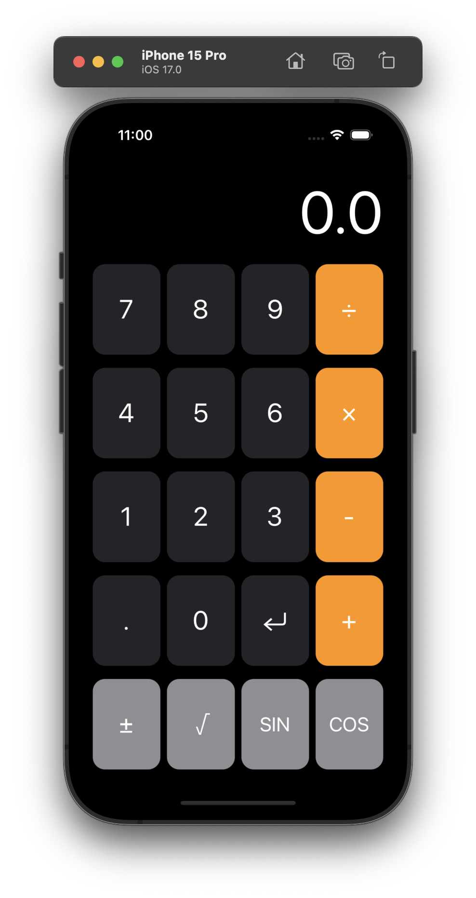
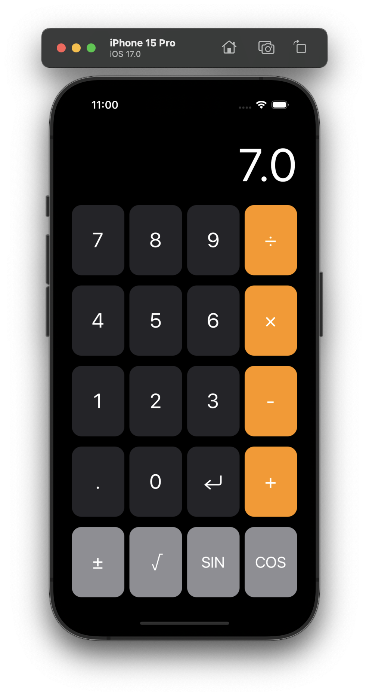
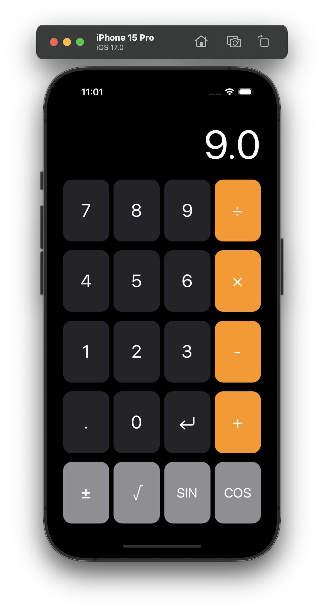
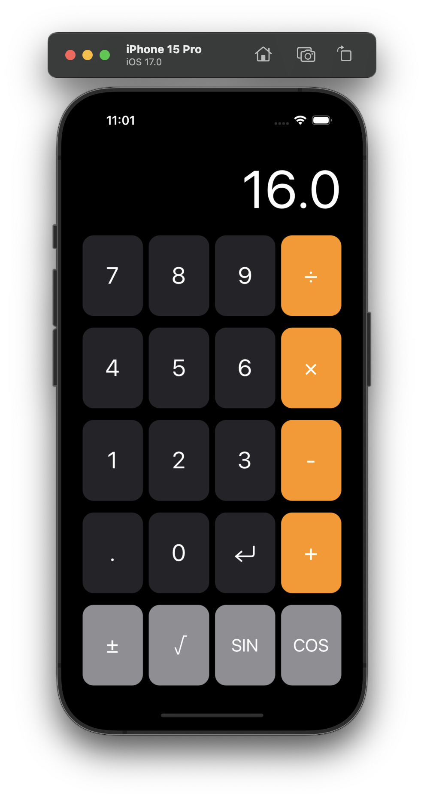
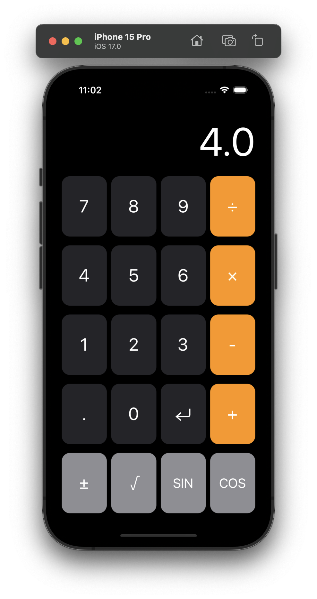
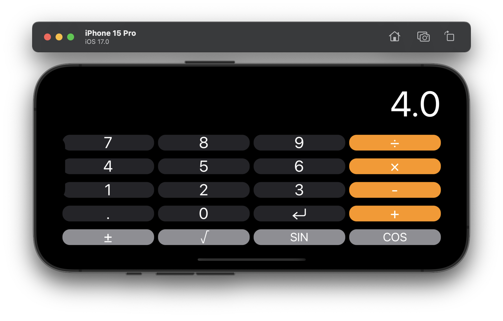

# RPN Calculator
Reverse Polish Notation calculator styled to reflect the design of typical Apple calculator applications. The application follows the Model-View-Controller (MVC) architectural pattern. The view controller handles the logic for pressing digits, entering values, and calling operations; the value being displayed on screen is evaluated with a computed property.

The model is instantiated lazily from the view controller and handles evaluation of the values and operations being pushed to the stack from the view controller. Two cases are implemented for unary and binary operations to recusivly evaluate the stack.

The applcation is styled with classes for the various types of buttons and labels.

  
   

  
   

  
   

  

